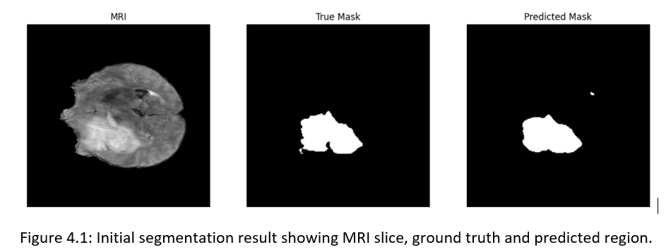
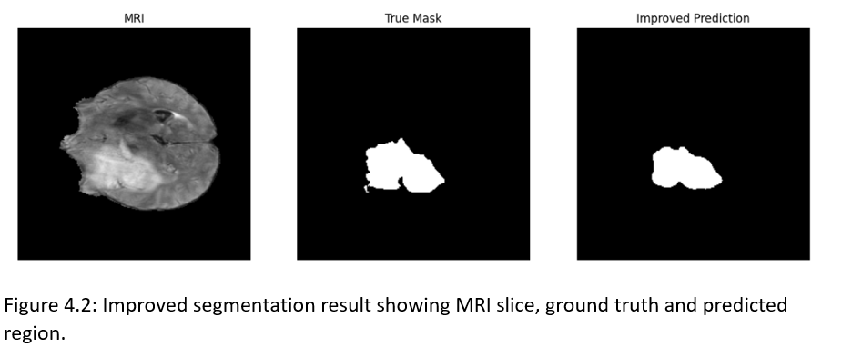
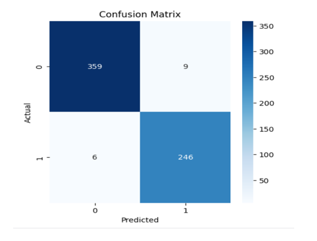

\# Brain Tumor Segmentation and Classification using BraTS

\## Overview

This project implements a deep learning pipeline for automated brain tumor segmentation and classification using MRI scans from the BraTS dataset.

The system is based on two models:

\- A U-Net architecture for tumor segmentation

\- A CNN-based classifier for tumor detection (tumor vs non-tumor)

\## Methods

\- 2D slice-based MRI processing

\- Z-score normalization

\- U-Net for segmentation

\- CNN for classification

\- Combined Binary Cross-Entropy (BCE) and Dice loss

\- Multi-patient training strategy

\## Results

\- Segmentation Dice Score: 0.93

\- Classification Accuracy: 97.6%

\- Precision: 96.47%

\- Recall: 97.62%

\- F1 Score: 97.04%

\## Project Structure

## 📊 Results Visualization

### 🧠 Segmentation Results

**Initial Model (Dice ≈ 0.71)**  

**Improved Model (BCE + Dice Loss)**  

---

### 📈 Classification Results

**Confusion Matrix**  

---

## 🧪 Performance Summary

| Task | Metric | Value |
|------|--------|------|
| Segmentation | Dice Score | 0.93 |
| Classification | Accuracy | 97.6% |
| Classification | Precision | 96.47% |
| Classification | Recall | 97.62% |
| Classification | F1 Score | 97.04% |
